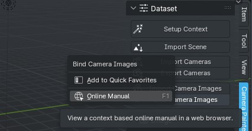

About
#####

How To Use This Documentation
*****************************

This user manual is an integral part of the add-on itself and contains a description of operators and their work, simple lessons that will help you start using the add-on, and automatically generated descriptions of properties.

Everything is documented - that is, you can simply hover over any add-on element (operator or property) while working, press the help key (``F1`` in Blender's standard layout), or call the documentation from the context menu:

and get information about this element.

.. note::
    For some properties, you can find more information here, as (as of version 3.6) Blender tooltips are limited to 400 ASCII characters. That is, for the localized version with utf-8 characters, it is even less. This is due to Blender performance, but it's hard to fit technical information into little more than a Twitter post (R.i.P.), so the full version of the descriptions for them can be found here.

.. Цей користувацький мануал є невід'ємною частиною самого доповнення і містить як опис операторів і їх роботи, прості уроки що допоможуть почати користуватися доповненням, так і автоматично згенеровані описи властивостей.

.. Задокументовано все - тобто можна просто під час роботи навести курсор на будь-який елемент доповнення (оператор, або властивість), натиснути клавішу для виклику допомоги (``F1`` у стандартній розкладці Blender), або ж з контекстного меню викликати документацію:

.. .. image:: ./images/online-manual.jpg

.. і отримати інформацію про цей елемент.

.. ../note::
    
..     Для деяких властивостей тут можна знайти більше інформації, оскільки (для версії 3.6) в підказках Blender є обмеження у відображенні 400 ASCII символів. Тобто для локалізованої версії з utf-8 символами це ще менше. Це пов'язано з продуктивністю Blender, але важко вмістити технічну інформацію у трохи більше ніж у пост у Twitter (R.i.P.), тому повну версію описів для них можна знайти саме тут.

History
********

Development began in 2019. Vlad wrote that sometimes there is a need to improve certain areas automatically
textures generated by photogrammetric programs and currently he uses photoshop for this, but it is not convenient, but
a more acceptable option at that time is Substance Painter, it just has a limit for the size of textures, so for him
goals simply do not fit. We discussed for a long time how best to solve the dilemma and decided to implement it with help
Blender drawing mode. It is open source, has a good community of users and is developing quite quickly.

In November 2019, we released the first release of the addon, then it was still called "Scan Paint" and in fact, it was quite
a simple implementation that used object modifiers for object projection, but the basic concepts were preserved.
The main disadvantage of this addon was that it was necessary to export images with distortion, which significantly increased
the number of temporary files on the disk and created additional inconvenience.

In October 2020, Camera Projection Painter 0.1.5 was released, which was implemented in a radically different way,
namely - its main part was written in C++, as a module for Python. This created a significant advantage - was added
automatic distortion of the projected object, faster generation of preview images, faster search
object and image name matches, but this also created a big problem with the distribution and update of the addon.
The problem was that once Blender started using updated versions of the Python ABI, the module was no longer available
use. Also, the problem was that Blender is distributed on different platforms - that is, it should be
assemble the module for each platform separately.

In any case, version 0.1.6 lasted quite a long time (3 years), although it required using an older version
Blender.
