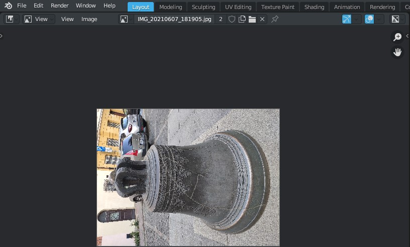

Addon Basics
############

------------------------------------------------------------------------------------------------------------------------

Data Blocks
***********

The types of data blocks with which the addon works are described here. When it comes to the concept and definition of data types, in Blender, unlike photogrammetric software, everything is a little more complicated. We have an image on disk - it was used to reconstruct the scene, and maybe opened in the current ``.blend`` file (or maybe even packed into the file as an archive). There are also files exported from photogrammetric software with data from the cameras from which these shots were taken - there are data on the position of the cameras in space, the length of the lens, the type and parameters of lens distortion, etc.

In order to tie everything together to work in Blender, using standard data blocks, the following hierarchy is used:

::

    Scene
    └── Object of type "Camera"
        └── Camera (Data block)
            └── Image

It is clear that we have several camera objects in the scene, but each of them can have different or the same camera data block - this also applies to just Blender, without this addon. The addon adds the image associated with the camera data block to the standard hierarchy.

So, which data block does Blender store which information?

.. _data-blocks-object:

Object
======

Data about extrinsic parameters. This is the position and orientation of the camera in space.

.. _data-blocks-camera:

Camera (Data Block)
===================

Data about :doc:`intrinsic <../props/cameraprops>` camera parameters. This is information about the lens, as well as some additional parameters for import-export from third-party software.

.. _data-blocks-image:

Image
=====

Pixel data (obviously). It is important here that for Blender an image is just a block of data, of which we are primarily interested in its name and file path.

------------------------------------------------------------------------------------------------------------------------

Names Comparison
****************

Now that there is an understanding of the basic concepts, let's move on to the topic of name comparison. As is clear from the text above, not one block of data is used for one image, as in photogrammetric software, but three. And each of them has its own name.

* :ref:`Camera objects <data-blocks-object>` that have been imported, for example, via the ``FBX`` format, will most often have image filenames, but possibly no file extension. The objects that were created using the :doc:`import camera operator <./ops/import-cameras>` will not have a file extension in the name.

* :ref:`Camera data blocks <data-blocks-camera>` most often have standard names (`Camera`, `Camera.001`, ...) after importing the scene, and probably - after :doc:`importing camera data <./ops/import-cameras>`, but for some file formats, such as ``FBX`` exported from Reality Capture, it will be the name of the image without the file extension.

* :ref:`Images <data-blocks-image>` are most often named the same as image files, but there are quite possible situations when the image data block in Blender has a completely different name (for example, if you open one image or create a generated one and then specify the path to another for the same data block).

* :ref:`The image file path <data-blocks-image>` always points to a specific file on disk, so obviously the name matches exactly. But this path may not be on disk because the image may have been packed into ``*.blend`` and the file may have been moved or deleted.

.. image:: ./images/image-filepath.jpg
    :align: center

Regarding the different types of exported camera data files, there can also be different camera names. They can be with or without a file extension, they can be with a changed character register. For example, Reality Capture Metadata (XMP) files are named the same as images, but obviously have a different file extension because they are ``xml`` documents rather than images.

All this information is necessary to understand how the add-on automation works. This applies to :doc:`importing and binding cameras and images <./ops/bind-camera-images>`, :doc:`importing camera data <./ops/import-cameras>`.
