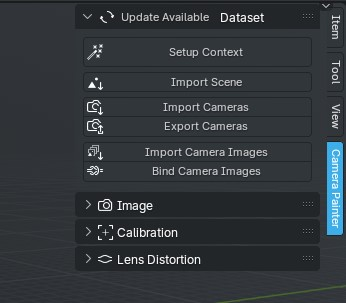
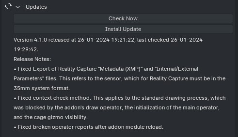
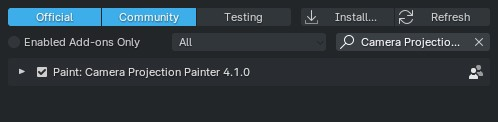
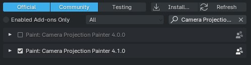

Installation and Updates
########################

Installation
============

You can install an addon `in a standard way <https://docs.blender.org/manual/en/latest/editors/preferences/addons.html#installing-add-ons>`_. There is nothing complicated here 😉

.. Встановити доповнення можна `у стандартний спосіб <https://docs.blender.org/manual/en/latest/editors/preferences/addons.html#installing-add-ons>`_. Тут немає нічого складного 😉

Updates
=======

Everything is a little more complicated here, but not much. Obviously, most users only installing an addon once, after updating the Blender, and then when the current version stops working on newer or from some sources learns about new critical features. This addon has its own update system for users who do not use Git.

The updates are checked automatically when you open the Blender (don't worry, this is a background process, so it does not interfere with work). If the system detects an update, a message will appear in the user interface:

If you click on it then information about the update would appear:

The upgrade is also in the standard method, but automatically:

Other update systems modify current files, instead the previous version will simply be disabled but will not be changed or deleted any files:

That is, if for some reason you want to return to the previous version, you must turn off the updated and only then - turn on the previous.

.. Тут вже все трохи складніше, але не набагато. Очевидно що більшість користувачів встановлює доповнення лише раз, після оновлення Blender, а потім - коли поточна версія перестає працювати на новіших або з якихось джерел дізнається про нові критичні для його роботи фічі. Це доповнення має власну систему оновлення для користувачів які не користуються Git.

.. Перевірка оновлень відбувається автоматично, коли Ви відкриваєте Blender (не хвилюйтеся, це фоновий процес, тому він не перешкоджає роботі). Якщо система виявить оновлення, в користувацькому інтерфейсі доповнення з'явиться повідомлення:

.. .. image:: ./images/update-available.jpg

.. Якщо на нього натиснути то відкриється інформація про оновлення:  

.. .. image:: ./images/update-info.jpg

.. Встановлення оновлення відбувається також у стандартний спосіб, тільки автоматично:

.. .. image:: ./images/update-installed.jpg

.. Інші системи оновлень модифікують поточні файли, натомість тут попередню версію буде просто вимкнено, але не буде змінено чи видалено жодних файлів:

.. .. image:: ./images/update-versions.jpg

.. Тобто якщо з якихось причин бажаєте повернутися до попередньої версії, необхідно вимкнути оновлену і лише потім - увімкнути попередню.
