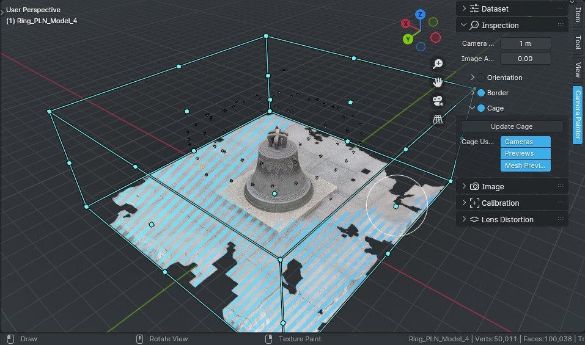

Update Cage
###########

.. Встановлює регіон для роботи до меж поточної сцени. Враховуються межі об'єкта та положення всіх камер сцени. Після :doc:`налаштування контексту <setup-context>` його буде встановлено автоматично, але якщо його було змінено то в такий спосіб можна оновити регіон.

Set the region to work to the current scene bounds. The boundaries of the object and the position of all scene cameras are taken into account. It would be set automatically after :doc:`setting context <setup-context>`, but if it has been changed, you can re-calculate the region in this way.

