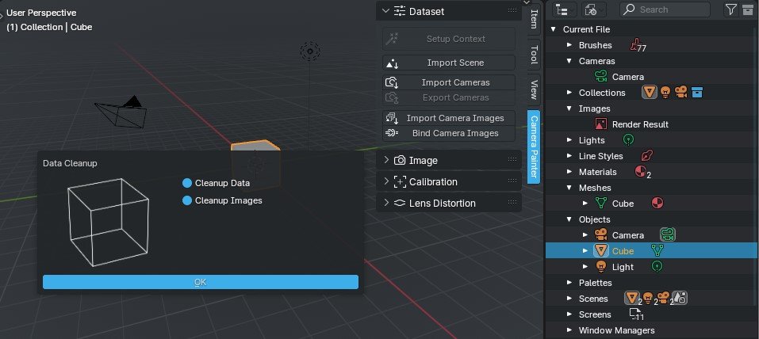

Data Cleanup
############

:doc:`Setup context <setup-context>` stage, during which you can clear existing scene data.

If the file contains:

* Cube
* Material
* Camera
* Lamp

that is, it is a standard scene, then it will be asked to :ref:`clean up this data <Cleanup Data>`.

If there is only one "Render Result" image in the file, it will also be prompted to :ref:`cleanup images <Cleanup Images>`.

If you want to leave everything as it is, you need to turn off all execution options and simply agree to execution - for example, if you need to complete the settings that were interrupted at one of the following stages.

Cleanup Data
============

Delete object, mesh, material, texture, light and camera data-blocks

Cleanup Images
==============

Delete all image data-blocks

