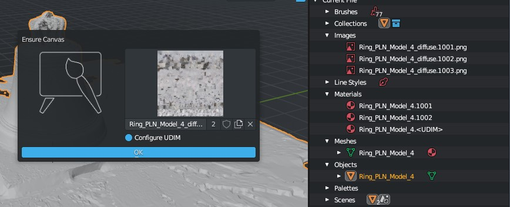

Ensure Canvas
#############

Stage of :doc:`context setup <setup-context>` during which you need to choose a canvas to paint on.

If you skip it and at the there is no canvas, then the addon work will continue but in a limited mode - obviously there will be nothing to paint on, but you can still work with import-export. If it is necessary to draw on an empty image and it is not previously in the file, the :doc:`creation operator <create-new-canvas>` is provided. To quickly select an image, you can use the :doc:`quick canvas selection <quick-select-canvas>` operator.

.. Стадія :doc:`налаштування контексту <setup-context>` під час якої необхідно обрати полотно для малювання.

.. Якщо її пропустити і при цьому не буде встановленого полотна то робота доповнення продовжиться але в обмеженому режимі - очевидно що не буде на чому малювати, але все ще можна працювати з імпортом-експортом. Якщо ж необхідно намалювати на пустому зображенні а попередньо в файлі його немає, передбачено :doc:`оператор створення <create-new-canvas>`. Для швидкого вибору зображення можна скористатися оператором :doc:`швидкого вибору полотна <quick-select-canvas>`.
