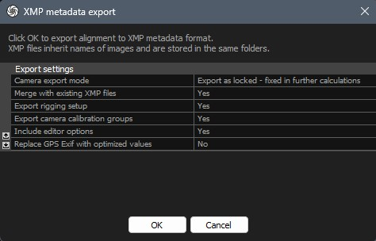
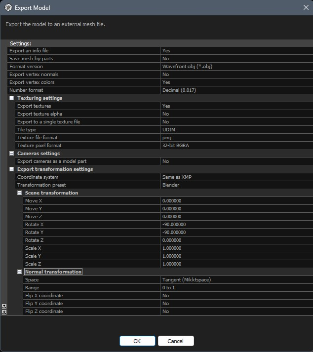
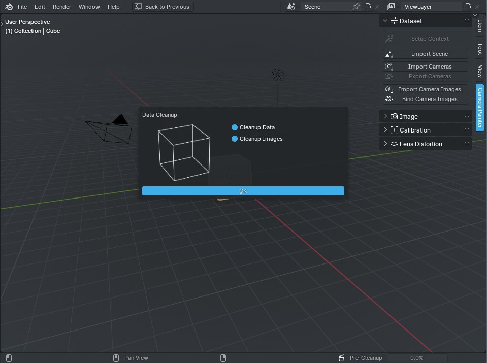
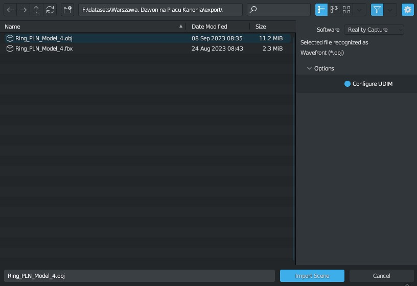
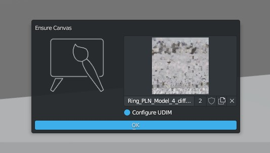
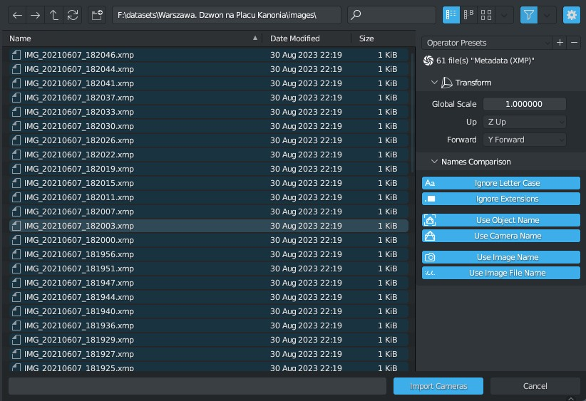
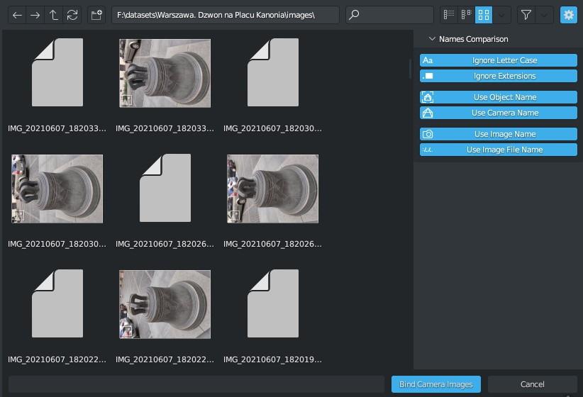
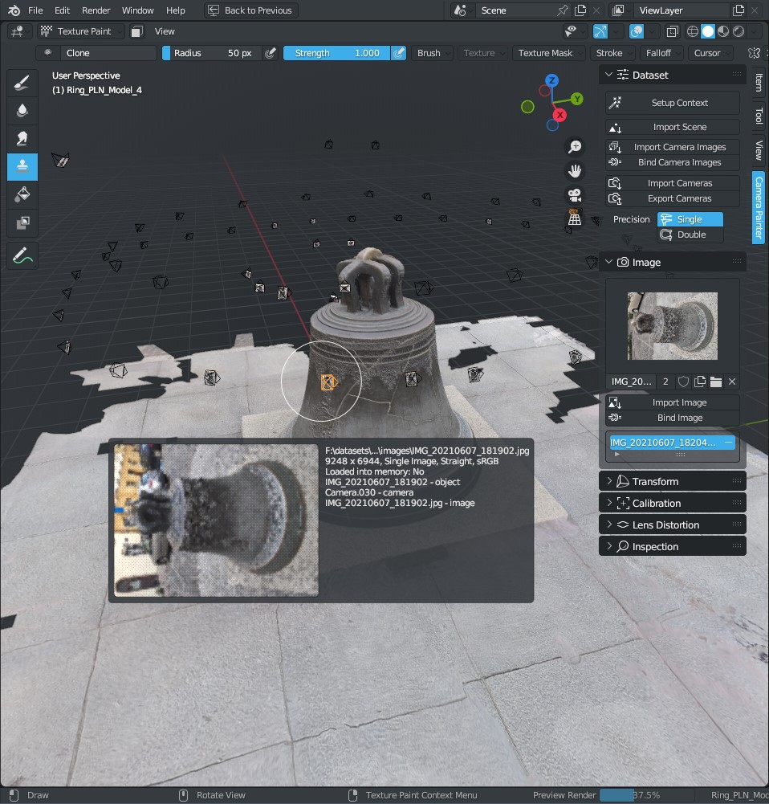

Quick Start
###########

Standard and recommended methods of working with the add-on are described here. Of course, no one forces you to use them - here you can experiment at your own discretion.

.. note::

    The current version of the addon only supports **Reality Capture** files. It is obvious that we plan to expand the support of files of third-party software.

Reality Capture
***************

* **Export camera data**

* **Export object wire**

In order to simplify the task when importing the model to Blender, we export the model as a Wavefront (.obj) file. In newer versions of Blender (3.2+), this type of file is imported quickly and contains only the data needed to work with the addon. The important options here are:

    * ``Coordinate System`` - ``Same as XMP``
    * ``Transformation Preset`` - ``Blender``

These will be used :ref:`as presets for the <Software>` import from Reality Capture when :doc:`importing the scene <./ops/import-scene>`.

* **Setup Context**

Next, you need to import this data. Start Blender and run :doc:`setup context <./ops/setup-context>`. There is nothing in the standard scene that will help us in our work, so this data can be deleted. This should also be done if, for example, you have finished adjusting one scene and want to move on to the next dataset. Therefore, the first question will be whether to clear the existing data:

Next, select the file containing the object wire and import it.

Then you need to choose the texture that we will adjust.

Next, we import camera data. This will allow you to use lens distortion without exporting distortion corrected images.

The next step will be linking the images to the camera objects.

And after that you can start adjusting the texture.

.. Тут описано стандартні і рекомендовані методи роботи з доповненням. Звісно, ніхто не змушує використовувати саме їх - тут можна експериментувати на власний розсуд.

.. .. note::

..     The current version of the addon only supports **Reality Capture** files. It is obvious that we plan to expand the support of files of third-party software.

.. Reality Capture
.. ***************

.. * **Експорт даних камер**

.. .. image:: ./images/qs-rc-export-metadata-xmp.jpg

.. * **Експорт сітки об'єкту**

.. Для того щоб спростити собі завдання під час імпорту моделі до Blender, експортуємо модель як Wavefront (.obj) файл. У нових версіях Blender (3.2+) цей тип файлів імпортується швидко і містить лише необхідні для роботи з доповненням дані. Тут важливими опціями є:

..     * ``Coordinate System`` - ``Same as XMP``
..     * ``Transformation Preset`` - ``Blender``

.. Їх буде використано :ref:`як попередні налаштування для <Software>` імпорту з Reality Capture під час :doc:`імпорту сцени <./ops/import-scene>`.

.. .. image:: ./images/qs-rc-export-obj.jpg

.. * **Налаштування Контексту**

.. Далі необхідно імпортувати ці дані. Запускаємо Blender і запускаємо :doc:`налаштування контексту <./ops/setup-context>`. В стандартній сцені немає нічого що допоможе нам у роботі, тому ці дані можна видалити. Це також необхідно зробити якщо наприклад, Ви закінчили корегувати одну сцену і хочете перейти до наступного набору даних. Тому у першу чергу буде питання чи очистити наявні дані:

.. .. image:: ./images/qs-data-cleanup.jpg

.. Далі - обираємо файл що містить сітку об'єкту і імпортуємо його.

.. .. image:: ./images/qs-import-scene.jpg

.. Потім треба обрати текстуру яку будемо коригувати.

.. .. image:: ./images/qs-ensure-canvas.jpg

.. Далі - імпортуємо дані камер. Це дозволить використовувати дисторсію лінзи без експорту зображень з корекцією дисторсії.

.. .. image:: ./images/qs-import-cameras.jpg

.. Наступним кроком буде пов'язування зображень до об'єктів-камер.

.. .. image:: ./images/qs-bind-images.jpg

.. І після цього можна починати коригувати текстуру.

.. .. image:: ./images/qs-complete.jpg
